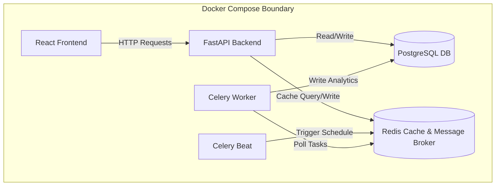
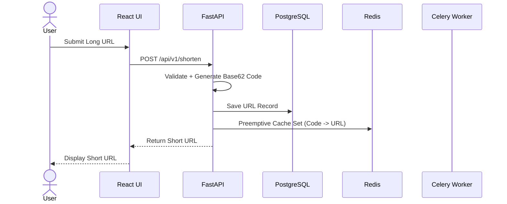
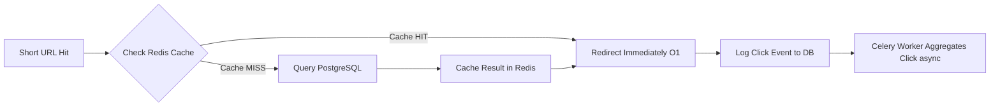

<div align="center">
  <h1>🔗 LinkForge — Scalable URL Shortener</h1>
  <p>A production-grade, high-performance URL shortening and routing service.</p>
  
  <p>
    
    
    
    
    
  </p>

  <p>
    
    
    
  </p>
</div>

---

## 📸 Project Screenshots

<div align="center">
  
  <br/>
  
</div>

---

## 🏗️ System Architecture



---

## 🔄 URL Shortening Data Flow



---

## ⚡ Redirect Resolution Flow



---

## 📊 Performance & Architecture Highlights

| Concern | Pattern Used | Benefit |
| Read performance | Redis cache-first lookup | Sub-millisecond redirect |
| Write decoupling | Celery async workers | Non-blocking API responses |
| Scalability | Docker Compose services | Independent horizontal scaling |
| Data integrity | PostgreSQL ACID | Reliable URL + analytics storage |
| Security | Stateless JWT (1h access / 7d refresh) | Fast auth, no DB lookup |
| Abuse prevention | Slowapi rate limiting | DDoS and scraping resistance |

---

## 🛠️ Features

<table>
  <thead>
    <tr>
      <th>Feature</th>
      <th>Technical Mechanism</th>
    </tr>
  </thead>
  <tbody>
    <tr>
      <td>Base62 Encoding</td>
      <td>Generates unique, short identifier hashes for long URLs to prevent collision.</td>
    </tr>
    <tr>
      <td>Redis Caching</td>
      <td>Caches redirects preemptively on creation for fast O(1) lookups.</td>
    </tr>
    <tr>
      <td>JWT Authentication</td>
      <td>Implements stateless authorization with short-lived tokens and refresh rotation.</td>
    </tr>
    <tr>
      <td>Analytics Dashboard</td>
      <td>Presents visual trends of click events using charts and database aggregations.</td>
    </tr>
    <tr>
      <td>QR Code Generation</td>
      <td>Generates downloadable vector QR codes for links.</td>
    </tr>
    <tr>
      <td>Link Expiration</td>
      <td>Implements TTL boundaries on URLs that automatically expire and purge.</td>
    </tr>
    <tr>
      <td>Rate Limiting</td>
      <td>Enforces request capping using Slowapi middleware to prevent API abuse.</td>
    </tr>
    <tr>
      <td>Background Tasks</td>
      <td>Uses Celery beat and worker queues for daily cleanup and log aggregations.</td>
    </tr>
  </tbody>
</table>

---

## 🚀 Getting Started

### Prerequisites

| Tool | Version | Purpose |
| Docker | 20.10+ | Containerized execution environment |
| Docker Compose | 2.0+ | Multi-container orchestration |
| Git | 2.30+ | Version control and repository management |

### Setup Instructions

1. Clone the repository:
   ```bash
   git clone https://github.com/sachin-saroj/scalable-url-shortener.git
   cd scalable-url-shortener
   ```

2. Copy the example configuration to a local environment file:
   ```bash
   cp .env.example .env
   ```

3. Configure environment variable secrets inside `.env`.

4. Start all application services:
   ```bash
   docker-compose up --build -d
   ```

---

## ⚙️ Environment Variables

| Variable | Required | Default | Description |
| DATABASE_URL | Yes | postgresql+asyncpg://shortener:password@db:5432/url_shortener | Core database connection string |
| REDIS_URL | Yes | redis://redis:6379/0 | Caching database connection string |
| SECRET_KEY | Yes | your_app_secret_key_here | Server cryptography secret key |
| ACCESS_TOKEN_EXPIRE_MINUTES | No | 60 | Expire limit of JWT access credentials |
| REFRESH_TOKEN_EXPIRE_DAYS | No | 7 | Expire limit of JWT refresh credentials |
| TRUSTED_PROXIES | No | | Comma-separated list of proxy server IPs |
| GRAFANA_ADMIN_PASSWORD | Yes | change_me_strong_password | Grafana monitoring admin credential |

---

## 🔒 Security Model

> [!WARNING]
> Tokens are NOT server-side revoked on logout. A compromised access token
> remains valid for up to 1 hour. This is an intentional performance
> trade-off. A Redis denylist can be added for stricter requirements.

---

## 🧪 Test Coverage

| Category | Test Count |
| Encoding | 10 |
| Validation | 15 |
| Caching | 15 |
| Auth | 20 |
| URL Lifecycle | 15 |
| Security Headers | 5 |
| Rate Limiting | 5 |
| Background Tasks | 10 |

### Test Commands

Run the full pytest suite:
```bash
cd backend
.venv\Scripts\pytest
```

Run tests with test coverage reporting:
```bash
python -m pytest --cov=app --cov-report=term-missing
```

Run tests within a specific module:
```bash
python -m pytest tests/test_url_service.py -v
```

---

## 📁 Project Structure

```
.
├── backend
│   ├── alembic
│   ├── app
│   ├── tests
│   └── Dockerfile
├── frontend
│   ├── public
│   ├── src
│   └── Dockerfile
├── docker-compose.dev.yml
├── docker-compose.yml
└── .env.example
```

---

## 🗺️ Roadmap

- [x] Redis cache-first redirect
- [x] Celery background analytics aggregation
- [x] JWT stateless auth
- [x] QR code generation
- [ ] Redis-based token denylist on logout
- [ ] Link password protection
- [ ] Team/organization accounts
- [ ] Prometheus + Grafana monitoring dashboard (in progress)
- [ ] API key auth for programmatic access

---

<div align="center">
  Built with FastAPI and PostgreSQL · Not deployed to production · Architected for real-world patterns
</div>
